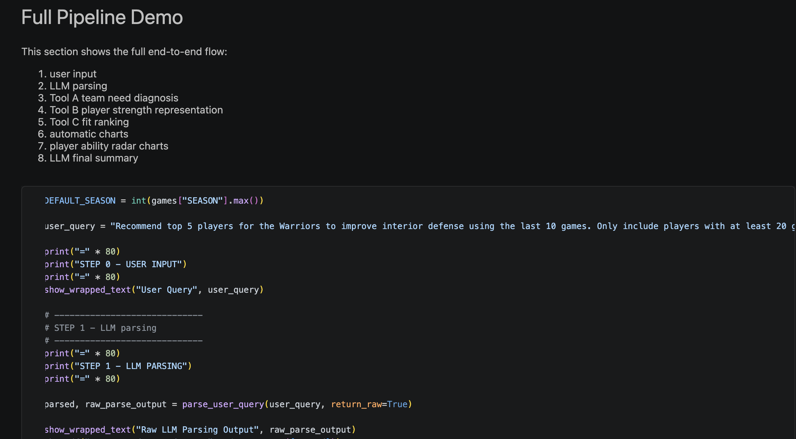
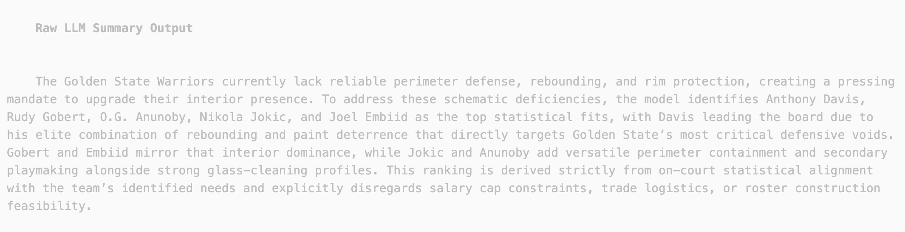

# NBA Roster Upgrade Agent
### An LLM-Driven Player Recommendation and Scouting System for Team Need Diagnosis

🏀 A modular NBA analytics project that combines **LLM-based planning**, **interpretable team diagnosis**, **player fit ranking**, and **natural-language scouting report generation**.

---

## Overview

This repository presents an **LLM-driven roster upgrade agent** designed to recommend NBA players based on a team’s tactical weaknesses.

Instead of relying on a single black-box model, the system decomposes the problem into modular analytical tools coordinated by an LLM-based planner. Given a natural-language request such as:

> "Recommend top 5 players for the Warriors to improve interior defense using the last 10 games. Only include players with at least 20 games and 18 average minutes."

the system parses the query into structured constraints, diagnoses team weaknesses, builds player skill representations, ranks candidates by fit, and generates a final scouting-style explanation.

---

## Why This Project Is Interesting

This project is more than a ranking script. It is an **agent-style sports analytics system** that combines:

- natural-language basketball query understanding
- interpretable statistical diagnosis
- player representation learning through structured features
- fit-based candidate ranking
- LLM-generated scouting explanations

The goal is to make player recommendation systems more **flexible**, more **explainable**, and closer to **real front-office reasoning**.

---

## Pipeline Overview

The system follows four stages:

1. **LLM Parsing & Planning**  
   Convert the user query into structured constraints such as team, tactical goal, top-k, recent-game window, and availability filters.

2. **Feature Engineering & Data Retrieval**  
   Build standardized team-level and player-level representations.

3. **Analytical Modules (Tool A–C)**  
   - **Tool A** diagnoses team weaknesses  
   - **Tool B** builds structured player skill vectors  
   - **Tool C** computes fit scores and ranks candidates

4. **LLM-Based Result Synthesis**  
   Translate numerical outputs into a structured scouting report:
   - What does the team lack?
   - Which players best fit?
   - Why do they fit?

---

## Mini Demo

### Example Query
> Recommend top 5 players for the Warriors to improve interior defense using the last 10 games. Only include players with at least 20 games and 18 average minutes.

### End-to-End Demo Overview

This demo shows the full pipeline from:
- parsed natural-language query
- team need diagnosis
- player filtering and representation
- fit scoring and ranking
- supporting visualizations

### Fit Ranking Close-Up

The ranking module scores players based on how well their strengths align with the team’s most urgent tactical weaknesses.

### LLM Scouting Summary

After ranking, the LLM generates a scouting-style explanation that connects team weaknesses with player strengths and explains why the top recommendations fit the request.

---

## Core Modules

### Tool A — Team Need Diagnosis
Tool A is designed as an **interpretable diagnosis module** rather than a pure prediction model.

It uses:
- rolling-window team statistics
- league-wide Z-score normalization
- Ridge Regression coefficients

to construct a **Need Weight Vector**, where each dimension reflects:
- how weak the team is in that area
- how important that weakness is for winning

### Tool B — Player Strength Representation
Tool B builds a **PlayerVector** for each player using:
- box-score statistics
- advanced features
- standardized skill indicators

It also computes derived strengths such as:
- rebounding strength
- rim protection
- other relative skill dimensions

### Tool C — Fit Scoring and Ranking
Tool C computes a fit score by matching **team needs** with **player strengths**, then sorts candidates into a Top-K recommendation list.

Each recommendation is also paired with a best-match explanation indicating what part of the player profile most strongly aligns with the team’s needs.

---

## Demo Findings

In the current Warriors demo:

- the query is correctly parsed into structured constraints
- the system identifies **Rebounding** and **Rim Protection** as the most relevant weaknesses for the requested goal of interior defense
- after filtering on minimum games and minutes, **236 players** remain in the candidate pool
- the ranking output is logically consistent with the diagnosed weaknesses

---

## Current Limitation: Superstar Bias

A key finding from the current version is a limitation we call **Superstar Bias**.

Because the current fit score is driven by strong statistical profiles, elite stars naturally dominate the ranking output. This means the Top-5 recommendations can lean heavily toward All-NBA level players rather than realistic trade-feasible role players.

This is still a useful intermediate result because it shows that the core ranking engine works. But the next step is to move from:

- **best overall player**
to
- **best realistic fit under practical constraints**

---

## Future Improvements

Planned next-step improvements include:

### 1. Position-Relative Normalization
Currently, rebounding and rim protection can over-favor big men because players are compared too broadly across the league.

Future versions will use **position-specific Z-scores** to identify more context-aware fits.

### 2. Salary and Age Constraint Integration
To reduce Superstar Bias and improve realism, future versions will integrate:
- salary cap proxy data
- age and timeline constraints
- trade feasibility considerations

This will support queries such as:
> "Find me a rim protector under $15M/year."

### 3. Sensitivity Analysis of Need Weights
We plan to test how stable the recommendations remain when the team need weights are slightly perturbed.

This will help evaluate whether the system gives robust tactical advice or reacts too strongly to small changes in team statistics.

---

## Project Structure

    .
    ├── src/
    │   └── main.py
    ├── notebooks/
    │   └── mini_demo.ipynb
    ├── outputs/
    │   └── ...
    ├── assets/
    │   ├── pipeline.png
    │   ├── demo_overview.png
    │   ├── fit_ranking_closeup.png
    │   └── llm_summary.png
    ├── README.md
    └── requirements.txt

---

## Quick Start

    pip install -r requirements.txt
    python src/main.py

---

## Author

**Ruize Ma**  
New York University

Contributions include:
- refining the project direction after TA feedback
- writing the demo and result section
- pushing the system toward a more complete LLM-driven recommendation pipeline

---

## Status

This repository currently presents the **Milestone 2 demo version** of the project.

The next version will focus on:
- more realistic player recommendations
- stronger constraint-aware ranking
- better robustness and trade-feasibility modeling
